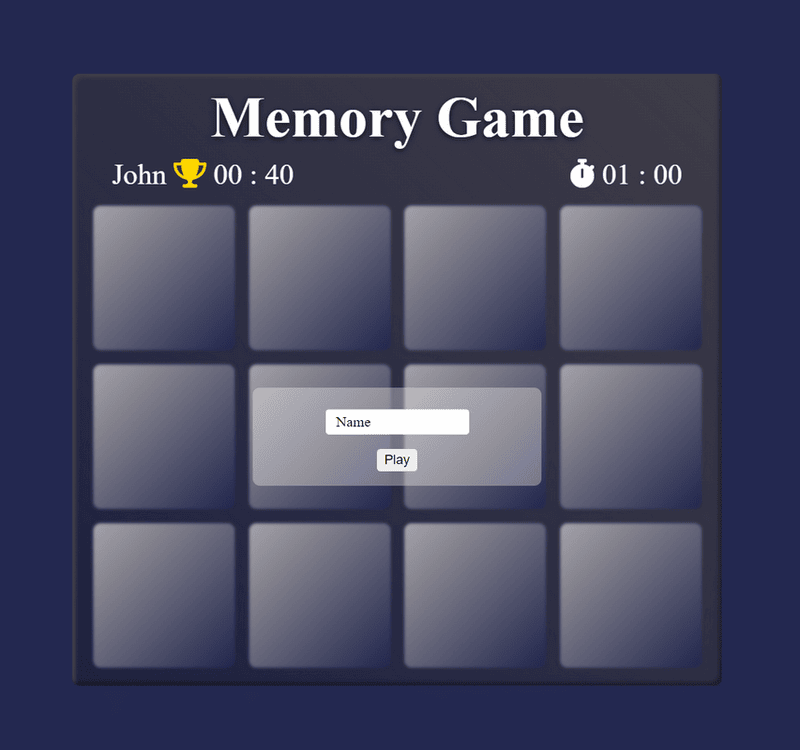
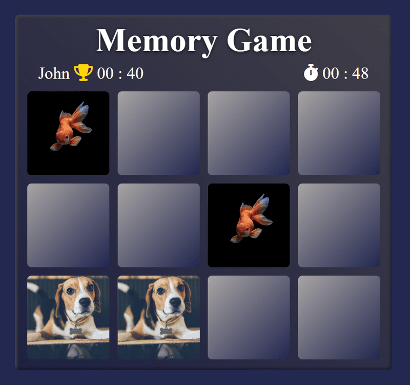

# Memory Game Javascript




## Fonctionnalités :
- Vérification du nom du joueur.
- Enregistrement des infos du joueur ( nom et meilleur temps ) dans le local storage.
- Chronomètre.
- Affichage du meilleur temps.


## Tester le projet :

```terminal
git clone https://github.com/Cyril-Develop/Memory-Game-JS